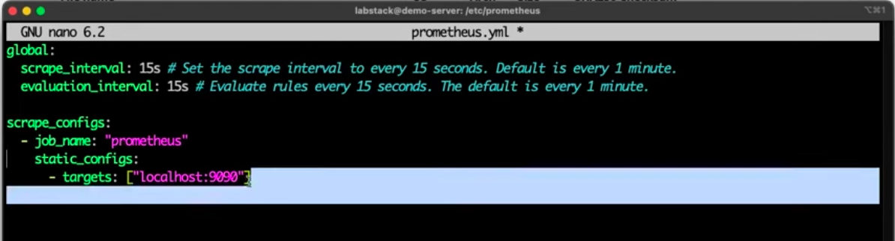
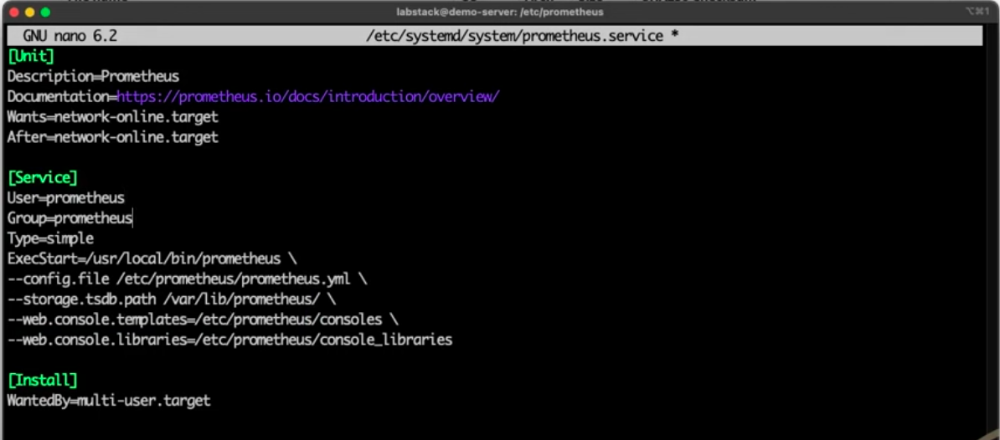
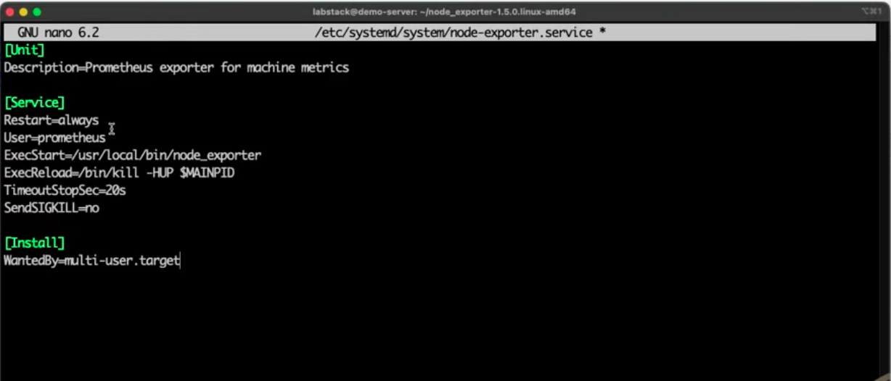
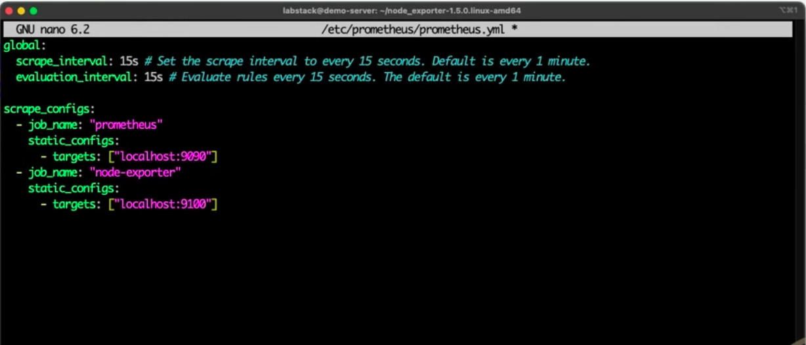

# Prometheus

Download : [prometheus-3.2.0.linux-amd64.tar.gz](https://github.com/prometheus/prometheus/releases/download/v3.2.0/prometheus-3.2.0.linux-amd64.tar.gz)

```bash
tar -xvf prometheus-3.2.0.linux-amd64.tar.gz
```

## Create User :

```bash
sudo groupadd —system prometheus
sudo user add —system -s /sbin/nologin -g prometheus prometheus
sudo mv prometheus promtool /usr/local/bin/

sudo mkdir /etc/prometheus
sudo mkdir /var/lib/prometheus
sudo chown -R prometheus:prometheus /var/lib/prometheus/
sudo mv consoles/ console_libraries/ prometheus.yml /etc/prometheus/

cd /etc/prometheus
sudo nano prometheus.yml
```



```bash
sudo nano /etc/systemd/system/prometheus.service
```



```bash
sudo systemctl daemon-reload
sudo systemctl status prometheus.service
sudo systemctl enable —now prometheus.service

sudo lsof -n -i | grep prometheus
```

Download : [node_exporter-1.9.0.linux-amd64.tar.gz](https://github.com/prometheus/node_exporter/releases/download/v1.9.0/node_exporter-1.9.0.linux-amd64.tar.gz)

```bash
tar -xvf node_exporter-1.9.0.linux-amd64.tar.gz

sudo mv node_exporter /usr/local/bin

sudo nano /etc/systemd/system/node-exporter.service
```



```bash
sudo systemctl daemon-reload
sudo systemctl status node-exporter.service
sudo systemctl enable —now node-exporter.service

sudo lsof -n -i | grep node

sudo nano /etc/prometheus/prometheus.yml
```



```bash
sudo systemctl restart prometheus 
```